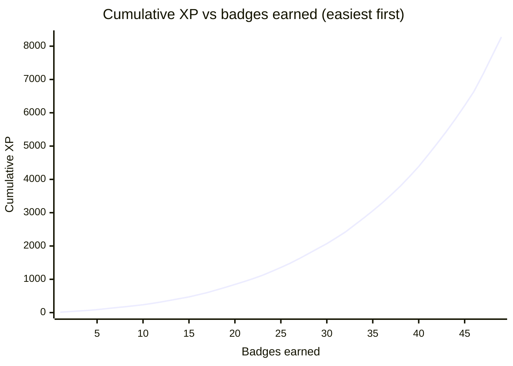

# Cashie: Badges & Ranks: The Climb

How the rank ladder is earned, in what order badges usually unlock, and how fast a real user climbs based on how much they actually use the app.

> Source of truth: ranks live in `Cashie/Models/Rank.swift`, the badge catalog in `Cashie/Models/Badge.swift`, and the XP-to-rank math in `Cashie/App/RankEngine.swift`. If those change, regenerate this file.

> **Retuned (June 2026).** The XP economy and rank thresholds are the original design and were left untouched. To make the climb faster we lowered the badge **targets** (the requirements), calibrated to a realistic **~3-4 logs/week** user. Same XP per badge, the finish lines just moved closer. See [What changed](#what-changed-in-this-tuning).

---

## TL;DR

- **49 badges** across **6 families**, worth **8,276 XP** in total. XP per badge and the rank thresholds are unchanged.
- Your **rank is derived from total XP** of unlocked badges. It only ever goes up; a quiet week never demotes you.
- We made badges easier to *earn*, not worth more: every target came down (logging recalibrated to ~3-4 logs/week, fewer goals to fund, smaller save/deposit milestones, shorter streak and loyalty counts).
- Result, calibrated to realistic usage: an **average user reaches Emerald by ~month 3 and Diamond by ~month 6**; a **heavy (daily) user reaches Legendary at ~month 6**.
- Four badges were renamed because their old titles named a dollar/goal amount the new target no longer matches: **Four Figures → Rainy Day**, **Five Figures → Vault**, **High Five → On a Roll**, **One Year Strong → Mainstay**.

---

## How ranking works

Every badge you unlock awards XP. Your rank is whatever tier your **cumulative badge XP** has reached. Nothing is stored as a counter, it is re-derived from real activity, so it can never drift from what you actually did, and it never drops.

| Rank | XP to hold | Gem |
|------|-----------:|-----|
| Bronze | 0 | brown shield |
| Silver | 250 | silver shield |
| Gold | 700 | gold trophy |
| Emerald | 1,500 | green gem |
| Diamond | 2,800 | cyan gem |
| Master | 4,600 | purple crown |
| Legendary | 7,000 | orange flame |

---

## How fast do real users climb?

The tuning is anchored to realistic activity. Three personas, defined by how much they log, save, deposit, fund goals, and streak:

| Persona | Logging | Saving | Deposits | Goals funded | Best streak | Active |
|---------|---------|--------|----------|--------------|-------------|--------|
| **Light** | ~1-2 / week | ~$60 / mo | ~1 / mo | 1 by ~mo 5 | up to ~2 weeks | most months |
| **Average** | **~3-4 / week** | ~$150 / mo | ~3 / mo | first by ~mo 2 | up to 30 to 45 days | every month |
| **Heavy** | daily (~2 / day) | ~$700 / mo | ~10 / mo | ~1 / month | 60+ days by ~mo 3 | every month |

Projected rank by month (XP, rank):

| Month | Light user | Average user | Heavy user |
|------:|------------|--------------|------------|
| 1 | 172, Bronze | 381, **Silver** | 1,581, **Emerald** |
| 2 | 336, Silver | 851, Gold | 3,046, **Diamond** |
| 3 | 596, Silver | 1,561, **Emerald** | 4,676, **Master** |
| 4 | 786, Gold | 2,081, Emerald | 5,786, Master |
| 6 | 1,311, Gold | 2,946, **Diamond** | 7,936, **Legendary** |
| 9 | 1,981, **Emerald** | 4,586, Diamond | 8,276, Legendary |
| 12 | 2,586, Emerald | 4,876, **Master** | 8,276, Legendary |

**First reaches each rank:**

| | Silver | Gold | Emerald | Diamond | Master | Legendary |
|---|---|---|---|---|---|---|
| Light | ~2 mo | ~4 mo | ~7 mo | ~19 mo | - | - |
| **Average (3-4/wk)** | ~1 mo | ~2 mo | **~3 mo** | ~6 mo | ~12 mo | - |
| Heavy (daily) | <1 mo | <1 mo | ~1 mo | ~2 mo | ~3 mo | **~6 mo** |

So the target is met: the **average 3-4/week user reaches Emerald in ~3 months** (Diamond by ~6), and a **heavy user reaches Legendary at ~month 6**. Legendary still scales with usage: lighter users keep climbing, just slower.

> These are projections from the personas above. The single biggest swing factor is logging rate. If real users log more or less than 3-4/week, re-run the model in `Cashie/Models/Badge.swift` order.

---

## The 6 badge families (what you actually grind)

Targets shown are the **new** (eased) requirements. XP is unchanged. Two families are time-gated (you cannot rush them): streaks and loyalty.

### Logging: just log purchases (recalibrated to ~3-4 logs/week)
| Badge | Requirement | XP |
|-------|-------------|---:|
| First Move | Log 1 purchase | 12 |
| Getting Started | Log 3 | 18 |
| Getting Going | Log 7 | 24 |
| Warmed Up | Log 12 | 30 |
| Tracker | Log 20 | 40 |
| Dedicated | Log 30 | 65 |
| Diligent Logger | Log 45 | 90 |
| Logbook | Log 65 | 115 |
| Bookkeeper | Log 90 | 150 |
| Archivist | Log 130 | 210 |
| Ledger Lord | Log 200 | 300 |
| Power Logger | Log 300 | 420 |

### Saving: total saved across goals
| Badge | Requirement | XP |
|-------|-------------|---:|
| Pocket Change | Save $40 | 18 |
| Piggy Bank | Save $80 | 28 |
| Saver | Save $150 | 45 |
| Nest Egg | Save $250 | 65 |
| Rainy Day *(was Four Figures)* | Save $400 | 100 |
| Cushion | Save $700 | 150 |
| Safety Net | Save $1,100 | 210 |
| Big Saver | Save $1,700 | 290 |
| War Chest | Save $2,500 | 400 |
| Vault *(was Five Figures)* | Save $3,600 | 560 |

### Deposits: number of goal deposits
| Badge | Requirement | XP |
|-------|-------------|---:|
| Squirrel | 1 deposit | 18 |
| Stasher | 2 deposits | 32 |
| Collector | 3 deposits | 50 |
| Diligent | 5 deposits | 85 |
| Committed | 8 deposits | 140 |
| Devoted | 14 deposits | 220 |
| Machine | 24 deposits | 360 |

### Goals: fully funded goals
| Badge | Requirement | XP |
|-------|-------------|---:|
| Goal Getter | Fund 1 goal | 80 |
| Double Up | Fund 2 goals | 120 |
| Finisher | Fund 3 goals | 170 |
| On a Roll *(was High Five)* | Fund 4 goals | 260 |
| Closer | Fund 5 goals | 380 |
| Dream Maker | Fund 6 goals | 560 |

### Streaks: consecutive on-budget days (TIME-gated)
| Badge | Requirement | XP |
|-------|-------------|---:|
| Warming Up | 2-day streak | 28 |
| On Fire | 5-day streak | 50 |
| Relentless | 10-day streak | 85 |
| Locked In | 15-day streak | 125 |
| Untouchable | 21-day streak | 175 |
| Unbreakable | 30-day streak | 250 |
| Ironclad | 45-day streak | 350 |
| Centurion | 60-day streak | 520 |

### Loyalty: months active (TIME-gated, cannot be rushed)
| Badge | Requirement | XP |
|-------|-------------|---:|
| Settling In | 1 month | 28 |
| Sticking Around | 2 months | 50 |
| Regular | 3 months | 80 |
| Veteran | 4 months | 150 |
| Loyalist | 6 months | 230 |
| Mainstay *(was One Year Strong)* | 8 months | 340 |

---

## Usual earn order (easiest XP first)

Badges sorted by XP, cheapest first. Because XP is unchanged, this order and the cumulative totals are identical to the original design; only the requirements moved. **Bold rows are rank-ups.**

| # | Badge | Requirement | Family | XP | Total XP | Rank after |
|--:|-------|-------------|--------|---:|---------:|------------|
| 1 | First Move | Log 1 purchase | Logging | 12 | 12 | Bronze |
| 2 | Getting Started | Log 3 purchases | Logging | 18 | 30 | Bronze |
| 3 | Pocket Change | Save $40 | Saving | 18 | 48 | Bronze |
| 4 | Squirrel | 1 deposit | Deposits | 18 | 66 | Bronze |
| 5 | Getting Going | Log 7 purchases | Logging | 24 | 90 | Bronze |
| 6 | Piggy Bank | Save $80 | Saving | 28 | 118 | Bronze |
| 7 | Warming Up | 2-day streak | Streaks | 28 | 146 | Bronze |
| 8 | Settling In | 1 month | Loyalty | 28 | 174 | Bronze |
| 9 | Warmed Up | Log 12 purchases | Logging | 30 | 204 | Bronze |
| 10 | Stasher | 2 deposits | Deposits | 32 | 236 | Bronze |
| **11** | **Tracker** | **Log 20 purchases** | **Logging** | **40** | **276** | **SILVER** |
| 12 | Saver | Save $150 | Saving | 45 | 321 | Silver |
| 13 | Collector | 3 deposits | Deposits | 50 | 371 | Silver |
| 14 | On Fire | 5-day streak | Streaks | 50 | 421 | Silver |
| 15 | Sticking Around | 2 months | Loyalty | 50 | 471 | Silver |
| 16 | Dedicated | Log 30 purchases | Logging | 65 | 536 | Silver |
| 17 | Nest Egg | Save $250 | Saving | 65 | 601 | Silver |
| 18 | Regular | 3 months | Loyalty | 80 | 681 | Silver |
| **19** | **Goal Getter** | **Fund 1 goal** | **Goals** | **80** | **761** | **GOLD** |
| 20 | Diligent | 5 deposits | Deposits | 85 | 846 | Gold |
| 21 | Relentless | 10-day streak | Streaks | 85 | 931 | Gold |
| 22 | Diligent Logger | Log 45 purchases | Logging | 90 | 1,021 | Gold |
| 23 | Rainy Day | Save $400 | Saving | 100 | 1,121 | Gold |
| 24 | Logbook | Log 65 purchases | Logging | 115 | 1,236 | Gold |
| 25 | Double Up | Fund 2 goals | Goals | 120 | 1,356 | Gold |
| 26 | Locked In | 15-day streak | Streaks | 125 | 1,481 | Gold |
| **27** | **Committed** | **8 deposits** | **Deposits** | **140** | **1,621** | **EMERALD** |
| 28 | Bookkeeper | Log 90 purchases | Logging | 150 | 1,771 | Emerald |
| 29 | Cushion | Save $700 | Saving | 150 | 1,921 | Emerald |
| 30 | Veteran | 4 months | Loyalty | 150 | 2,071 | Emerald |
| 31 | Finisher | Fund 3 goals | Goals | 170 | 2,241 | Emerald |
| 32 | Untouchable | 21-day streak | Streaks | 175 | 2,416 | Emerald |
| 33 | Archivist | Log 130 purchases | Logging | 210 | 2,626 | Emerald |
| **34** | **Safety Net** | **Save $1,100** | **Saving** | **210** | **2,836** | **DIAMOND** |
| 35 | Devoted | 14 deposits | Deposits | 220 | 3,056 | Diamond |
| 36 | Loyalist | 6 months | Loyalty | 230 | 3,286 | Diamond |
| 37 | Unbreakable | 30-day streak | Streaks | 250 | 3,536 | Diamond |
| 38 | On a Roll | Fund 4 goals | Goals | 260 | 3,796 | Diamond |
| 39 | Big Saver | Save $1,700 | Saving | 290 | 4,086 | Diamond |
| 40 | Ledger Lord | Log 200 purchases | Logging | 300 | 4,386 | Diamond |
| **41** | **Mainstay** | **8 months** | **Loyalty** | **340** | **4,726** | **MASTER** |
| 42 | Ironclad | 45-day streak | Streaks | 350 | 5,076 | Master |
| 43 | Machine | 24 deposits | Deposits | 360 | 5,436 | Master |
| 44 | Closer | Fund 5 goals | Goals | 380 | 5,816 | Master |
| 45 | War Chest | Save $2,500 | Saving | 400 | 6,216 | Master |
| 46 | Power Logger | Log 300 purchases | Logging | 420 | 6,636 | Master |
| **47** | **Centurion** | **60-day streak** | **Streaks** | **520** | **7,156** | **LEGENDARY** |
| 48 | Vault | Save $3,600 | Saving | 560 | 7,716 | Legendary |
| 49 | Dream Maker | Fund 6 goals | Goals | 560 | 8,276 | Legendary |

> This is the abstract XP-cheapest path. A real user's order depends on their habits, and the realistic *timeline* (above) is what tells you how long each rank actually takes.

---

## The difficulty curve (the graph)

Cumulative XP as you earn badges, cheapest first. This curve is **unchanged** by the retuning (XP didn't move); what changed is how quickly real activity reaches each badge.

```
Cumulative XP
8,276 |                                                # 49 (all badges)
      |                                            # #
7,000 |· · · · · · · · · · · · · · · · · · · · · ·#· · LEGENDARY (badge 47)
      |                                        ###
4,600 |· · · · · · · · · · · · · · · · ·#· · · · · · · MASTER     (badge 41)
      |                              ###
2,800 |· · · · · · · · · · · ·#· · · · · · · · · · · · DIAMOND    (badge 34)
      |                   ###
1,500 |· · · · · · ·#· · · · · · · · · · · · · · · · · EMERALD    (badge 27)
  700 |· · · ·#· · · · · · · · · · · · · · · · · · · · GOLD       (badge 19)
  250 |·#· · · · · · · · · · · · · · · · · · · · · · · SILVER     (badge 11)
    0 +--------------------------------------------------
       0    10    20    30    40    49   Badges earned
```



### Badges vs XP per rank

| Climb | Badges to cross | XP gap |
|-------|----------------:|-------:|
| start to Silver | 11 | 250 |
| Silver to Gold | 8 | 450 |
| Gold to Emerald | 8 | 800 |
| Emerald to Diamond | 7 | 1,300 |
| Diamond to Master | 7 | 1,800 |
| Master to Legendary | 6 | 2,400 |

The badge *count* per rank is roughly flat (about 6 to 8), but the XP gap widens toward the top. Lowering targets did not change this shape; it changed how fast a realistic user moves along it.

---

## How hard is each rank, really?

For an **average 3-4 logs/week user**:

- **Bronze (start):** automatic.
- **Silver (~month 1):** log ~20 purchases, save ~$150, a couple deposits, a short streak.
- **Gold (~month 2):** ~30-45 logs, first funded goal, a 10-day streak, 2-3 months casual loyalty.
- **Emerald (~month 3):** ~65-90 logs, ~$700 saved, a 15-21 day streak, 1-2 funded goals. **This is the "most users reach Emerald in 2-3 months" target.**
- **Diamond (~month 6):** ~130 logs, ~$1,100 saved, a 30-day streak, 3-4 funded goals.
- **Master (~month 12):** sustained use across most families.
- **Legendary:** reached around **month 6 by a heavy daily user**; longer for lighter users. Needs a 60-day streak, ~$2,500+ saved, ~300 logs, 5-6 funded goals, plus several months of loyalty.

### Time still gates the very top

Streaks (up to 60 days) and loyalty (up to 8 months) are real calendar time, so even a maximally active user cannot sprint to Legendary in a couple of weeks. That is by design.

---

## What changed in this tuning

**Goal: average users reach Emerald/Diamond in 2-3 months and a heavy user reaches Legendary ~6 months, WITHOUT changing any XP or rank threshold.**

- **XP per badge: unchanged.** **Rank thresholds: unchanged** (Silver 250 ... Legendary 7,000).
- **Every badge target lowered**, calibrated to ~3-4 logs/week:

| Family | Old targets | New targets |
|--------|-------------|-------------|
| Logging | 1,5,10,15,25,50,75,100,150,250,400,600 | 1,3,7,12,20,30,45,65,90,130,200,300 |
| Saving | $50 ... $10,000 | $40 ... $3,600 |
| Deposits | 1,3,5,10,20,35,60 | 1,2,3,5,8,14,24 |
| Goals | 1,2,3,5,7,10 | 1,2,3,4,5,6 |
| Streaks | 3,7,14,21,30,45,60,90 days | 2,5,10,15,21,30,45,60 days |
| Loyalty | 1,2,3,6,9,12 months | 1,2,3,4,6,8 months |

- **Four renames** (old title named an amount the new target no longer matches): Four Figures → **Rainy Day** ($400), Five Figures → **Vault** ($3,600), High Five → **On a Roll** (4 goals), One Year Strong → **Mainstay** (8 months).
- **Effect on existing users is only positive:** rank XP is re-derived live, so the same activity now clears more badges and maps to an equal-or-higher rank. Nobody is demoted, and no data migration is needed (badge IDs are unchanged).
